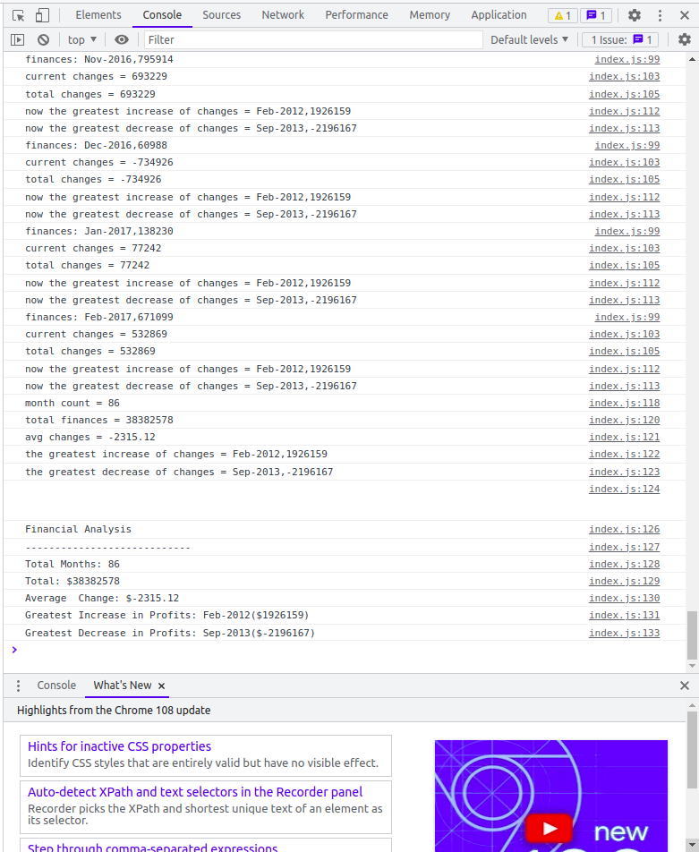
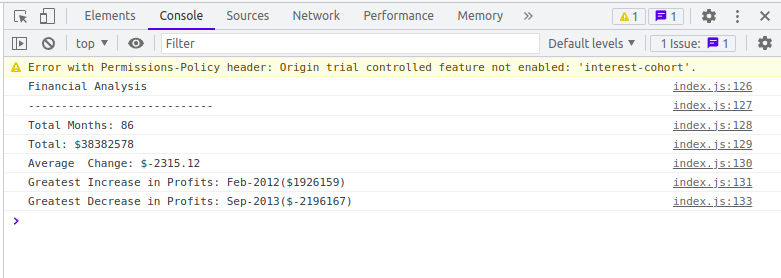

# Console-Finances

Using JavaScript to do some work like Excel.

## Usage

1. Go to the [deployed GitHub page](https://v7lanw.github.io/Console-Finances/)
2. Choose to open the debug output switch or not to
   

3. Press `F12` on your keyboard and choose `console` tab
   

4. Check the results in browser console, if the debug output switch is opened, you will see all the steps of processing as well as summary
   
   if the debug output switch is closed, you will only see the summary
   

## deployment

<https://v7lanw.github.io/Console-Finances/>

## Calculation

1. Getting the length of the table.
2. Using for loop to traverse all the items of the table, the table is actually a "matrix", the first column is the date string, the second column is the finances status of that month.
3. Before the for loop, setting some variables,
   + a variable for accumulating the total finances
   + a variable for calculating the changes and a variable for accumulating the total changes
   + two variable for calculating the changes between this month and last month, the initial value of last month finances is the finances at the very beginning
   + two variable for storing the maximum and minimum changes as well as date, the format is same as a row of original table
4. In one loop, 
   + accumulating the total finances
   + resetting the value of current month finances then calculate the changes
   + accumulating the total changes
   + updating the maximum changes and minimum changes
   + resetting the value of last month finances
   + adding some debug outputs with calculation
5. Making a summary using the format provided.

## Results


``` bash
Financial Analysis
----------------------------
Total Months: 86
Total: $38382578
Average  Change: $-2315.12
Greatest Increase in Profits: Feb-2012($1926159)
Greatest Decrease in Profits: Sep-2013($-2196167)
```
